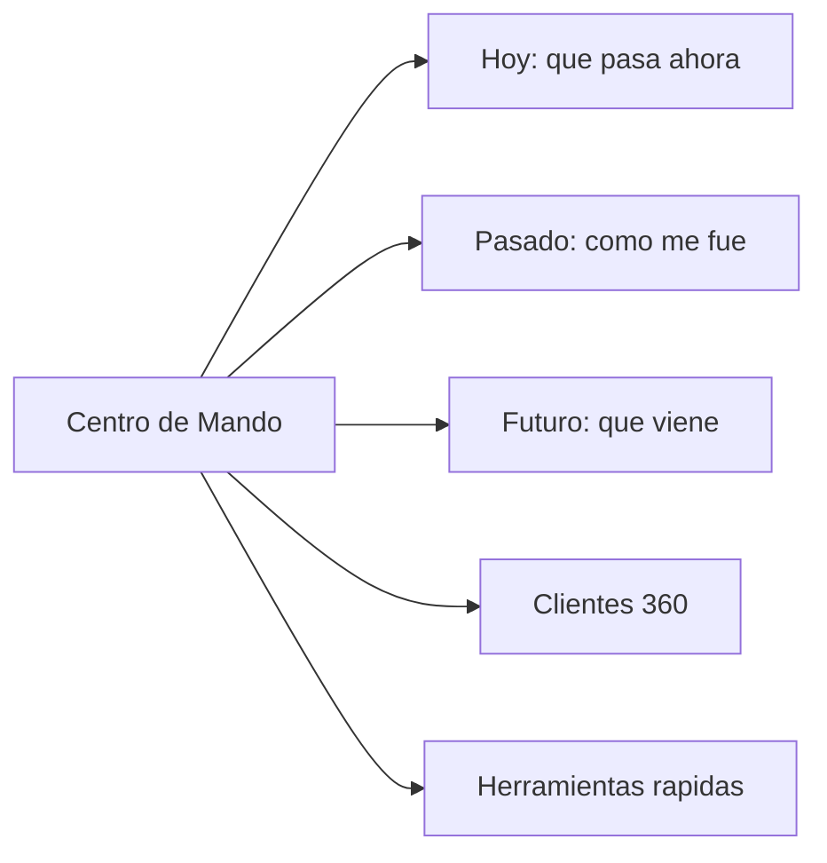

# PLAN_CIERRE_ERP.md — Cierre Katia Suite (entrega 26 mayo)

## 0. Decisiones tomadas

- **Rebrand**: el producto deja de llamarse "ERP Katia". Nombre propuesto: **Katia Suite** (alternativas: `Katia Manager`, `Katia Studio`, `Katia One`).
- **Hilo conductor**: cada cambio debe alimentar la sensacion de **"producto final, no demo"**. Si una mejora no aporta a esa sensacion, va a fase 2.
- **Estrategia de bugs**: auditoria modulo por modulo (no parches sueltos). Por cada modulo se arregla bug funcional + onClick muertos + flujo completo + ayuda contextual + audit + empty states en una sola pasada.
- **Visual**: la **arquitectura de informacion** se define desde Ola 1, y los **tokens visuales finales** (colores, tipografia, espaciado, radios, sombras, glass) tambien se definen en Ola 1 a partir de las referencias del dueno. Asi cada modulo construido en Olas 2-4 ya nace con el diseno final, y Ola 5 es solo pulido + consistencia, NO rediseno.
- **Tema**: oscuro como base (referencia visual que entregara el dueno) + claro como inverso del mismo sistema de tokens, no dos disenos paralelos.
- **Sistema visual cerrado**: las 6 referencias visuales fueron entregadas y analizadas. El sistema completo (paleta dual, tipografia, radios, sombras, glass, componentes) esta especificado en el **Apendice A** al final del plan y se implementa en Ola 1, listo para que cada modulo de Olas 2-4 nazca con el diseno final.
- **Privacidad**: facturas internas privadas, moneda local peruana, **sin** referencias a SUNAT/Peru/entidades fiscales en UI ni copies.
- **Modulos a revisar**: lo que dudemos quitar (Antifraude top-level, Seguridad separada, fusion Personal+Usuarios) **no se elimina**, se **desactiva tras feature flag** y queda documentado como deuda.
- **QA**: doble pasada — tecnico (Playwright E2E + unit tests de calculos) y humano (stress test simulando cliente real).
- **Mobile responsive OBLIGATORIO**: vendedores usaran tablet/celular en mostrador. Cada modulo debe pasar el checklist tambien en pantallas de 375px (movil) y 768px (tablet) ademas de desktop.
- **Filosofia "no demo"**: NO se agregan features nuevas del rubro (mermas, conversion de unidades, ventas a credito, devoluciones, ordenes de compra, etc). Esas quedan como **Backlog v1.1**. El objetivo de este cierre es que TODO lo que ya existe se sienta producto pulido, profesional, sin confusiones, sin botones muertos, sin sensacion de demo.
- **Calidad tecnica invisible**: este plan incluye todo lo que hace que un sistema "se sienta probado" aunque el cliente no lo vea (transacciones atomicas, concurrencia, indices, RLS, soft delete, caching, rate limiting, rollback). Sin esto, a las primeras horas de uso real aparecen bugs raros que matan la confianza.
- **Deadline**: 26 mayo como objetivo, no como restriccion rigida. Si una ola necesita medio dia mas para quedar bien, se toma. Producto a medias el 26 es peor que producto completo el 28.

## 1. Arquitectura de informacion nueva

### 1.1 Diagnostico del Inicio actual (screenshot revisado)

Problemas concretos a resolver:
- 9 tarjetas KPI compitiendo sin jerarquia (no se sabe que mirar primero).
- Nombres con jerga: "Penalidades activas", "Ventas por confirmar", "Adelantos pendientes", "Alertas operativas" vs "Alertas criticas" (suenan parecido, confunden).
- Metricas que repiten informacion: "Ingresos del periodo" + "Movimientos de caja recientes" muestran lo mismo desde dos angulos.
- "Bitacora" como modulo top-level sin contexto claro.
- "Cuenta admin" + "Usuarios" coexisten confusamente.
- Taxonomia del sidebar `GENERAL / VENTAS / ADMIN / CONTROL` son etiquetas tecnicas, no del negocio.
- Busqueda como input plano, no como accion prominente.
- Layout 4+4 cards arriba + 2 tablas abajo se siente wireframe, no producto pensado.

### 1.2 Rediseno del Inicio (ahora `Centro de Mando`) con proposito

Filosofia: cada elemento de la pantalla responde a UNA pregunta del dueno. Si no responde nada, sale.

Las preguntas reales del dueno al entrar al sistema cada manana:
1. **"Como vamos hoy?"** -> 1 numero grande: ingresos del dia (no del periodo, del DIA, comparado con ayer).
2. **"Que tengo que resolver YA?"** -> Lista corta priorizada de pendientes accionables (3-5 items max).
3. **"Donde esta mi negocio respecto al mes?"** -> 1 grafico de tendencia (linea simple, mes en curso vs mes anterior).
4. **"Tengo algo critico (stock, deudas, alertas)?"** -> Banner solo si hay algo critico, sino no aparece.
5. **"Quiero hacer algo rapido"** -> Atajos directos: nueva venta, nueva cotizacion, nuevo cliente.

Layout propuesto del nuevo `Centro de Mando` (sub-pestana "Hoy"):

```
+---------------------------------------------------------------+
|  Banner critico (solo si aplica): "2 productos sin stock"     |
+---------------------------------------------------------------+
|                                                                |
|   INGRESOS DE HOY              [grafico linea: mes en curso]   |
|   S/ 1,250.50                  ___                             |
|   +12% vs ayer                /   \____                        |
|                              /         \___                    |
+---------------------------------------------------------------+
|  Que resolver hoy (3-5 items priorizados)                      |
|  -> Reponer stock bajo (2 productos)                  [Abrir]  |
|  -> Confirmar 3 ventas en borrador                    [Abrir]  |
|  -> Cobrar S/ 450 a Juan Perez (vence hoy)            [Abrir]  |
+---------------------------------------------------------------+
|  Atajos rapidos                                                |
|  [+ Nueva venta]  [+ Cotizar]  [+ Cliente]  [+ Producto]      |
+---------------------------------------------------------------+
```

Sub-pestanas del Centro de Mando:
- **Hoy** (la vista anterior, accionable, lo que abre por defecto)
- **Pasado** (historicos, mes anterior, comparativos, top productos/clientes)
- **Futuro** (proyecciones, cotizaciones por vencer, cobros futuros, stock proyectado)
- **Clientes 360** (vista resumen sin ir al modulo completo)
- **Herramientas** (cotizacion rapida, venta directa, factura interna sin entrar al modulo)

Lo que **se elimina** del Inicio actual (queda en feature flag legacy por si se reactiva):
- Tarjetas "Empleados activos", "Alertas operativas estable", "Egresos del periodo" (el dueno no entra al sistema para mirar eso).
- Tabla "Movimientos de caja recientes" (vive en Caja, no en Inicio).
- "Plan de accion de hoy" se transforma en la lista priorizada accionable de la nueva vista.



### 1.3 Auditoria de nomenclatura (renombrar todo lo confuso)

Recorrer cada pantalla y aplicar regla: **nombre debe ser obvio para alguien que nunca abrio el sistema**. Ejemplos concretos a resolver:
- "Panel Gerencial" -> `Centro de Mando`
- "Bitacora" -> auditar que es. Si es log de actividad, vive en `Centro de Mando > Pasado` o como sub-pestana de Reportes. Si es notas, vive en cada modulo. NO como top-level.
- "Cuenta admin" + "Usuarios" + "Personal" -> consolidar en `Admin > Equipo`.
- "Penalidades activas" -> `Sanciones aplicadas` (o lo que el cliente realmente entienda).
- "Ventas por confirmar" -> `Ventas en borrador` (mas claro).
- "Adelantos pendientes" -> `Anticipos por aplicar`.
- "Alertas criticas" vs "Alertas operativas" -> unificar en `Alertas` con badge de severidad (alta/media/baja).
- "Ingresos del periodo" / "Egresos del periodo" -> `Ingresos del mes` / `Egresos del mes` (palabra concreta).
- Cualquier label tecnica (`servicio_corte_mueble`, `compra_inventario`) en categorias visibles -> humanizar (`Servicio de corte de mueble`, `Compra a proveedor`).

Resultado: glosario unificado en `docs/GLOSARIO.md` que define cada termino del producto en lenguaje del cliente.

### 1.4 Sidebar reorganizada (propuesta a validar)

Con secciones que SI dicen algo del negocio (no `GENERAL / ADMIN / CONTROL`):

**OPERACION DIARIA**
- Centro de Mando (antes Inicio + Panel Gerencial fusionados)
- Caja
- Ventas (todos los submodulos agrupados con sub-nav)
- Cotizaciones

**CATALOGO**
- Inventario
- Clientes

**ANALISIS**
- Reportes (Antifraude entra aqui como sub-pestana)

**CONFIGURACION**
- Equipo (Usuarios + Personal + Cuenta admin fusionados)
- Empresa (marca, datos, logo)
- Respaldo
- Mi cuenta (preferencias personales del usuario logueado)

Bitacora: se evalua en Ola 0 que es exactamente y se mueve a su lugar correcto (probablemente `Centro de Mando > Pasado` o `Reportes > Auditoria`).

## 2. Olas de trabajo (11 dias)

### OLA 0 — Sabado 16 mayo: Cimientos y limpieza
- Fix SQL critico: agregar columna `estado` en tabla `clientes` (migration + backfill).
- **Rebrand**: cambiar nombre en `package.json`, `README.md`, `<title>`, favicon, login, metadatos OG, manifest.
- Limpieza de basura del repo:
  - Eliminar `temp/`, `temp-mirror/`, `test-results/` (regenerable).
  - Eliminar archivos sueltos: `script.js`, `script2.js`, `script3.js`, `script4.js`, `next` (vacio), `proyecto-katia@0.1.0` (vacio).
  - Revisar `docs/` y consolidar `PROYECTO.md` + `PROYECTO_INTERNO.md` + `ALCANCE_V1.md` + `DEVELOPER_NOTES.md` en un solo `DOCS/` ordenado.
- Definir migracion de **codigos familiares de producto**: esquema `[CATEGORIA]-[SUBCAT]-[YYMM]-[SEQ]` (ej `MAD-ROB-2605-001` = Madera Roble Mayo 2026 secuencia 1). Funcion SQL/trigger que lo genere al insertar.
- Crear sistema de **feature flags** simple (tabla `feature_flags` o constantes) para modulos en revision.
- **Auditoria de la pantalla Inicio actual**: documentar elemento por elemento (con captura) cual responde a una pregunta real del dueno y cual es ruido. Decision archivada en `docs/AUDITORIA_INICIO.md`. Esta auditoria alimenta el rediseno del Centro de Mando de Ola 4.
- **Auditoria de nomenclatura global**: recorrer cada label, columna, boton y categoria del producto. Aplicar regla "obvio para alguien que nunca abrio el sistema". Resultado: `docs/GLOSARIO.md` con cada termino renombrado. Lista de renames concretos definida en seccion 1.3 del plan.
- **Resolver "Bitacora"**: auditar que contiene exactamente y decidir destino (Centro de Mando > Pasado / Reportes > Auditoria / desactivar via flag). NO debe seguir como top-level.
- **Auditoria de minimalismo funcional**: recorrer cada pantalla del producto y crear lista de "ruido a eliminar":
  - Graficos que no aportan informacion accionable (ej: pie chart con 2 categorias, sparkline que no se entiende sin contexto).
  - Tarjetas KPI duplicadas o vagas ("Total general" sin saber de que).
  - Botones de acciones que el usuario nunca va a usar (export en formato raro, opciones tecnicas en vista de usuario final).
  - Filtros redundantes o que generan parametros sin utilidad real.
  - Mensajes informativos repetitivos.
  - Animaciones excesivas o decorativas que distraen.
  - Iconos sin label que confunden.
- Cada elemento candidato a eliminar se marca con feature flag `legacy.<nombre>` desactivado por defecto. Si el cliente luego dice "lo necesitaba", se reactiva con un toggle, sin re-codear. Documentado en el handoff al cliente como "elementos archivados disponibles para reactivar".
- **Sentry (o similar)** integrado para capturar errores de produccion con sourcemaps.
- **Footer global** con version visible (`v1.0.0`) + fecha de ultima actualizacion + nombre comercial del cliente.
- **Datos seed de bienvenida**: script de seed que precarga 8-10 productos demo, 3 clientes ejemplo y 2 cotizaciones de muestra (todos eliminables, marcados con badge "demo") para que el primer login no se sienta vacio.
- **Soft delete global**: agregar columna `deleted_at` (timestamp nullable) a tablas con historia (clientes, productos, ventas, cotizaciones, movimientos_caja, usuarios). Politica: nunca borrar duro lo que tiene historia.
- **Indices de BD criticos**: revisar y crear indices en columnas que se filtran/ordenan mucho — `cliente_id`, `producto_id`, `fecha`, `estado`, `codigo`, `vendedor_id`, `created_at`. Sin indices a 5000 filas todo se cuelga.
- **Constraints de integridad**: revisar todas las tablas y agregar FKs faltantes, NOT NULL en columnas obligatorias, CHECK constraints donde aplique (ej: precio >= 0, stock >= 0).
- **Migraciones versionadas y reversibles**: cada migracion en `supabase/migrations/` con nombre `YYYYMMDDHHMMSS_descripcion.sql`, y un `down.sql` correspondiente para rollback.
- **Ambiente de staging** separado de produccion en Vercel + Supabase: branch `staging` deploya a `staging.katiasuite.com` con BD staging propia. Todo cambio se prueba ahi antes de produccion.

### Estrategia de migracion de BD Supabase (sin romper produccion)

Como el sistema YA esta en produccion con Vercel + Supabase configurados (login + claves activas), cada cambio de esquema sigue esta receta:

1. **Snapshot pre-migracion**: backup completo de la BD productiva (`pg_dump` via Supabase CLI) guardado con timestamp.
2. **Aplicar migracion en staging primero**: probar que la migracion corre sin error y los datos existentes quedan validos.
3. **Migraciones aditivas siempre**: agregar columnas como `NULLABLE` con default seguro (no `NOT NULL` directo). Llenar datos en backfill aparte. Despues recien hacer `NOT NULL` si aplica.
4. **Dual-write durante transicion**: si renombramos columna o tabla, mantener la vieja durante 1-2 deploys con triggers que sincronicen. Recien cuando todo el codigo apunta a la nueva, eliminamos la vieja.
5. **RLS policies actualizadas en la misma migracion**: nunca dejar tabla sin policy.
6. **Rollback testeado**: cada migracion `up.sql` tiene su `down.sql` y se prueba en staging que el down efectivamente revierte sin perder datos.
7. **Migracion via Supabase CLI**: `supabase migration new <nombre>` + `supabase db push --linked` apuntando a staging primero, luego produccion.
8. **Variables de entorno**: las claves ya configuradas en Vercel se respetan (`SUPABASE_URL`, `SUPABASE_ANON_KEY`, `SUPABASE_SERVICE_ROLE_KEY`). Si agregamos nuevas (Resend, Sentry, Upstash), se documentan en `.env.example` y se agregan a Vercel/staging/produccion en paralelo.

### Migraciones especificas de este cierre (lista exacta)

```
20260516_001_add_estado_clientes.sql            (Ola 0)
20260516_002_add_deleted_at_global.sql          (Ola 0)
20260516_003_add_indices_criticos.sql           (Ola 0)
20260516_004_add_constraints_integridad.sql     (Ola 0)
20260516_005_codigos_familiares_productos.sql   (Ola 0)
20260516_006_feature_flags_table.sql            (Ola 0)
20260517_001_audit_logs_table.sql               (Ola 1)
20260517_002_notifications_table.sql            (Ola 1)
20260517_003_rls_policies_review.sql            (Ola 1)
20260517_004_user_preferences_table.sql         (Ola 1)
20260519_001_rpc_cerrar_venta_atomic.sql        (Ola 3)
20260519_002_rpc_anular_venta_atomic.sql        (Ola 3)
20260519_003_rpc_confirmar_cotizacion_atomic.sql (Ola 3)
20260523_001_backup_schedule_table.sql          (Ola 4)
```

Cada migracion con su `down.sql` correspondiente.

### OLA 1 — Domingo 17 + Lunes 18: Sistema visual final + Plomeria + Auth/Roles
- Implementar el **Sistema de diseno cerrado del Apendice A** completo:
  - CSS variables `--katia-*` para tema oscuro y claro en `app/globals.css` (selectores `:root` y `[data-theme="light"]`).
  - Tailwind `theme.extend` con tokens (colors, fontFamily, borderRadius, boxShadow, spacing) leyendo las CSS vars.
  - Cargar fuentes `Geist` y `Geist Mono` via `next/font` en root layout.
  - Background ambient (blobs + patron de puntos) como componente reutilizable.
- Componentes base unificados YA con estilo final aplicado (no placeholder):
  - `<Card glass>` `<Button>` `<Modal>` `<Table>` `<EmptyState>` `<Skeleton>` `<HelpTooltip>` `<Toast>` `<Breadcrumbs>`
- Storybook ligero o pagina interna `/_design` con muestras de cada componente en ambos temas, para validar visualmente antes de propagar.
- **Audit log**: tabla `audit_logs` en Supabase + middleware/RLS que registre acciones criticas (crear, editar, eliminar, exportar).
- **Notificaciones in-app**: tabla `notifications` + campanita en header + dropdown con categorias (stock bajo, cotizacion vencida, cobro pendiente).
- Renombrar `Panel Gerencial` → `Centro de Mando` y crear shell con sub-pestanas internas (sin contenido aun).
- Validar Auth/Roles: verificar que cada rol (owner, gerencia, vendedor, etc.) ve solo lo que debe.
- **Busqueda global categorizada**: refactor del search actual para devolver resultados agrupados (Clientes / Productos / Cotizaciones / Ventas).
- **Manejo global de errores**: error boundaries por ruta + paginas `404` y `500` personalizadas con marca y boton "volver al inicio".
- **Marca del cliente**: refactor de [app/(dashboard)/admin/empresa/page.tsx](app/(dashboard)/admin/empresa/page.tsx) para que el dueno suba logo, defina nombre comercial, color primario opcional, direccion y telefono. Esos datos alimentan automaticamente: header del shell, facturas/PDFs, footer y emails.
- **Revision exhaustiva de RLS** (Row Level Security) en Supabase: una policy por tabla por rol. Vendedor solo ve sus ventas, gerencia ve todo de su sucursal, owner ve todo. Probar con usuarios de test de cada rol que efectivamente no vean lo que no deben.
- **React Query (TanStack Query)** integrado para caching, revalidacion, optimistic updates y background refetch. Reemplaza fetches sueltos. Configuracion global con `staleTime` razonable.
- **Email transaccional real**: integrar Resend (o similar) y conectar realmente a `forgot-password`, invitaciones de usuario, alertas configurables. Plantillas de email con marca del cliente (logo + colores). HOY probablemente NO funciona end-to-end.
- **Rate limiting**: middleware en endpoints sensibles (login, forgot-password, export masivo, import Excel). Usar Upstash Redis o tabla simple.
- **Politica de contrasenas**: minimo 8 caracteres, mezcla de tipos, no permitir las 100 mas comunes. Activar en Supabase Auth + validacion frontend.
- **Sesiones**: configurar duracion razonable, agregar opcion en `/configuracion` para "cerrar todas las sesiones activas".

### OLA 2 — Martes 19 + Miercoles 20: Datos maestros (Clientes + Inventario)

Para CADA modulo se ejecuta este checklist completo:
- Bug funcional resuelto
- Todos los `onClick` operativos (cero botones muertos)
- Validacion inline en formularios
- Empty state ilustrado cuando no hay datos
- Skeleton loader en cargas
- Auto-guardado de borradores en formularios largos
- Icono `?` con ayuda contextual REAL del modulo
- Acciones registradas en audit log
- Confirmacion solo en acciones destructivas
- **Mobile responsive**: probado en 375px (movil), 768px (tablet) y desktop. Tablas con scroll horizontal o vista alternativa de tarjetas en movil.
- **Performance**: paginar tablas que pueden superar 100 filas, lazy load de modales pesados, queries con `select` especifico (no `*` cuando hay joins).
- **Soft delete** aplicado en lugar de delete duro, con opcion "ver eliminados" para owner.
- **Sanitizacion de inputs**: especialmente en imports Excel (rechazar formulas, escapar caracteres peligrosos) y en cualquier campo libre que despues se renderiza.
- **Optimistic updates** con React Query donde aplique (ej: marcar cotizacion como aprobada da feedback instantaneo).
- **Loading states distintos por accion**: skeleton inicial, spinner inline en botones al guardar, barra global solo para navegacion entre paginas.
- **Manejo de errores por accion**: cada llamada a Supabase con try/catch + toast de error legible (no "Error: TypeError undefined") + log a Sentry con contexto.
- **Empty / Error / Loading / Success**: cada vista debe contemplar los 4 estados, no solo el "happy path".

**Clientes** ([app/(dashboard)/ventas/clientes/](app/(dashboard)/ventas/clientes/)):
- Aplicar checklist completo.
- Implementar columna `estado` en UI.

**Inventario** ([app/(dashboard)/inventario/page.tsx](app/(dashboard)/inventario/page.tsx)):
- Aplicar checklist completo.
- Blindar formulas (margen, stock, valoracion) con tests unitarios.

**Sistema de codigos familiares automaticos** (clave para sentir el inventario "inteligente"):
- El codigo se **genera solo** al escribir nombre + categoria. Se muestra en tiempo real debajo del input ("Codigo sugerido: `MAD-ROB-2605-001`") — NO el usuario lo escribe.
- Editable solo en modo avanzado (icono lapiz al lado), por si el cliente quiere personalizar.
- Algoritmo: `[CAT 3 letras]-[SUBCAT 3 letras]-[YYMM]-[SEQ 3 digitos]`. Las 3 letras se sacan del nombre via regla simple (primeras consonantes o palabras clave del diccionario por categoria).
- Diccionario por categoria: `Madera roble -> MAD-ROB`, `Tornillo autorroscante -> TOR-AUT`, `Barniz poliuretanico -> BAR-POL`, etc. El sistema mantiene un mapeo extensible.
- Si el cliente ingresa un termino no reconocido, sugiere las 3 primeras consonantes y permite editar.

**Catalogo facil para distintos tipos de producto** (muebles, tornillos, barniz, madera, etc.):
- **Categorias predefinidas con plantillas de campos**: cada categoria tiene su propio set de campos relevantes:
  - `Mueble`: medidas (ancho, alto, profundidad), material, color, acabado, precio.
  - `Madera`: especie, dimensiones (espesor, ancho, largo), unidad (pieza/m3/pies tablares), precio por unidad.
  - `Tornilleria/Ferreteria`: medida, material, presentacion (caja/unidad), cantidad por presentacion, precio.
  - `Quimicos (barniz/pintura/pegamento)`: presentacion (litros/galon), color, marca, rendimiento, precio.
  - `Servicio` (corte, lijado, instalacion): unidad de cobro (hora/m2/pieza), precio.
- **Modo "Agregar rapido"**: form compacto con SOLO los 4 campos esenciales (nombre, categoria, precio, stock inicial). Boton "Guardar y agregar otro" mantiene categoria seleccionada para no recargar mentalmente.
- **Modo "Agregar detallado"**: expande todos los campos de la plantilla.
- **Duplicar producto**: boton "Duplicar" copia un producto existente con todos sus datos, solo cambia nombre y codigo (util para variantes: "Tornillo 1/4 x 1cm" -> duplicar -> "Tornillo 1/4 x 2cm").
- **Importar lote desde Excel**: el flujo de import inteligente (Ola 2) permite cargar 50 tornillos de golpe desde una lista pegada de Excel, y el sistema los clasifica solo.
- **Atajos de teclado en formulario**: `Ctrl+S` guardar, `Ctrl+Enter` guardar y agregar otro, `Esc` cancelar.
- **Lista del inventario** con filtro por categoria como pill prominente arriba (no escondido en menu), busqueda instantanea por nombre/codigo, vista alternativa de tarjetas (mas visual) o tabla densa (mas datos).
- **Bulk actions**: seleccionar varios y aplicar accion (cambiar categoria, ajustar precio %, archivar, exportar).

**Excel bidireccional inteligente** (entregado por primera vez en estos dos modulos):
- **Import**: subir Excel arbitrario, parser que mapea columnas automaticamente, vista previa de clasificacion antes de confirmar, normalizacion de duplicados.
- **Export**: estructura "hecha a mano" — header con logo y fecha, columnas con anchos correctos, formatos numericos/moneda, tabs por categoria, totales en negrita.

**Lectura inteligente de PDFs** (donde aplique: facturas de proveedor, cotizaciones recibidas, listas de precios externas):
- NO solo extraer texto crudo (eso ya existe y se siente inutil).
- Usar parser semantico: identificar `cliente/proveedor`, `fecha`, `items` (descripcion + cantidad + precio + subtotal), `totales`, `condiciones`.
- Si el PDF es escaneado (imagen), aplicar OCR via Tesseract.js o servicio.
- Vista previa estructurada del resultado ANTES de importar: tabla con campos detectados, el cliente edita lo que el parser interpreto mal, confirma.
- Mapeo automatico al esquema interno (productos, precios, cliente).
- Si no se reconocen >=70% de los campos, mostrar mensaje claro "PDF no reconocido, ingresa manualmente" y un boton "ayudar a mejorar el parser" que envia el PDF (con consentimiento) para entrenar mejor.
- Esto hace que el cliente SIENTA que la herramienta sirve, no que extrae texto suelto inutil.

### OLA 3 — Jueves 21 + Viernes 22: Operacion diaria (Ventas + Cotizaciones + Caja)

Aplicar checklist de Ola 2 a CADA submodulo de Ventas:
- [app/(dashboard)/ventas/muebles-corte/page.tsx](app/(dashboard)/ventas/muebles-corte/page.tsx)
- [app/(dashboard)/ventas/muebles-personalizados/page.tsx](app/(dashboard)/ventas/muebles-personalizados/page.tsx)
- [app/(dashboard)/ventas/muebles-terminados/page.tsx](app/(dashboard)/ventas/muebles-terminados/page.tsx)
- [app/(dashboard)/ventas/madera-cortada/page.tsx](app/(dashboard)/ventas/madera-cortada/page.tsx)
- [app/(dashboard)/ventas/aserradero-servicios/page.tsx](app/(dashboard)/ventas/aserradero-servicios/page.tsx)
- [app/(dashboard)/ventas/alquiler-mixer/page.tsx](app/(dashboard)/ventas/alquiler-mixer/page.tsx)
- [app/(dashboard)/ventas/zonas-entrega/page.tsx](app/(dashboard)/ventas/zonas-entrega/page.tsx)
- [app/(dashboard)/ventas/proveedores-comparador/page.tsx](app/(dashboard)/ventas/proveedores-comparador/page.tsx)
- [app/(dashboard)/ventas/dashboard/page.tsx](app/(dashboard)/ventas/dashboard/page.tsx)

**Cotizaciones** ([app/(dashboard)/cotizacion/page.tsx](app/(dashboard)/cotizacion/page.tsx)):
- Checklist completo.
- Plantilla de **factura interna privada** (PDF): moneda local, sin RUC/SUNAT/referencias fiscales, marca de agua "Documento interno".
- Auto-guardado obligatorio (cotizaciones largas).
- **Sugerencia inteligente de precios**: el cliente SIEMPRE tiene el control final del precio (es su negocio). El sistema solo SUGIERE:
  - Al agregar un producto a una cotizacion, si hay >=3 ventas anteriores de ese producto, mostrar debajo del input: "Sugerencia: $X (promedio ultimas 5 ventas) - $Y (ultimo precio cobrado)".
  - Si NO hay historial suficiente, NO mostrar nada (no inventar sugerencias).
  - El input siempre vacio o con el precio base del producto, nunca prellenar con sugerencia (para no condicionar).
  - Boton "Usar sugerencia" si el cliente quiere copiarla con un click.
  - Misma logica en ventas directas y muebles personalizados.

### Optimizacion de calculos (sin tocar formulas)

**REGLA**: las formulas existentes de inventario, cotizacion, conversion, costo y demas NO se modifican. Funcionan, son del cliente, no se tocan. Solo se optimiza el TIEMPO de calculo via:
- **Memoizacion** (`useMemo`, `React.memo`) en componentes que recalculan al renderizar.
- **Debounce** en inputs que recalculan al tipear (300ms).
- **Calculos pesados a Web Workers** o a Supabase RPC si bloquean el thread principal.
- **Cache de resultados** en React Query con `queryKey` que incluya los inputs (evita recalcular si los datos no cambiaron).
- Auditar y eliminar recalculos innecesarios (loops, watchers redundantes).

**Caja** ([app/(dashboard)/caja/page.tsx](app/(dashboard)/caja/page.tsx)):
- Checklist completo.
- Cierre/cuadre del dia con export Excel "hecho a mano".
- Atajos de teclado para operacion rapida (cobro, devolucion).

**Operaciones criticas con transacciones atomicas** (refactor obligatorio):
- "Cerrar venta" debe ejecutarse como **transaccion atomica** (Supabase RPC con `BEGIN/COMMIT/ROLLBACK`): descontar stock + crear movimiento caja + crear venta + actualizar saldo cliente. Si algo falla, NADA queda escrito.
- "Anular venta" igual: revertir stock + revertir caja + marcar venta como anulada, todo o nada.
- "Confirmar cotizacion -> venta" igual.
- Concurrencia de stock: usar `UPDATE productos SET stock = stock - X WHERE id = Y AND stock >= X RETURNING *`. Si retorna vacio, error "stock insuficiente" (resuelve race conditions).

### OLA 4 — Sabado 23: Centro de Mando + Reportes
- **Implementar el rediseno del Centro de Mando segun seccion 1.2 del plan**:
  - Sub-pestana `Hoy` con la nueva arquitectura: 1 KPI grande del dia, grafico de tendencia mes, lista priorizada de pendientes accionables (3-5), atajos rapidos.
  - Banner critico que SOLO aparece si hay algo critico (cero ruido visual cuando todo esta bien).
  - Sub-pestana `Pasado`: historicos, comparativos, top productos/clientes.
  - Sub-pestana `Futuro`: cotizaciones por vencer, cobros futuros, stock proyectado.
  - Sub-pestana `Clientes 360`: vista resumen sin ir al modulo completo.
  - Sub-pestana `Herramientas`: cotizacion rapida, venta directa, factura interna sin entrar al modulo.
- Aplicar nomenclatura del `docs/GLOSARIO.md` a TODA la pantalla (cero jerga).
- Eliminar (con feature flag legacy) las tarjetas/tablas que no respondian preguntas reales del dueno (ver auditoria de Ola 0).
- KPIs ejecutivos con Recharts en `Pasado` y `Futuro`, NO en `Hoy` (Hoy es accion, no analisis).
- **Reportes** ([app/(dashboard)/reportes/page.tsx](app/(dashboard)/reportes/page.tsx)): checklist completo, embeber Antifraude como sub-pestana.
- **Personal** + **Admin/Usuarios**: fusionar tras feature flag (queda activable si quieres revertir).
- **Seguridad**: mover dentro de Cuenta como sub-pestana (con flag).
- **Pagina centralizada `/configuracion`**: unifica Cuenta + Empresa + Seguridad + Preferencias (tema, idioma, notificaciones) en una sola pantalla con sub-pestanas internas, asi el dueno no anda buscando ajustes por todos lados.
- **Respaldo automatico**: en [app/(dashboard)/admin/respaldo/page.tsx](app/(dashboard)/admin/respaldo/page.tsx) agregar opcion de "respaldo programado diario" (cron via Supabase Edge Function o Vercel Cron) + descarga manual + historial de los ultimos 7 respaldos.
- **Modo "Resetear datos para entrega limpia"** en `Admin > Respaldo`: boton protegido (solo owner) con DOBLE confirmacion + escribir "RESETEAR" para activarse. Lo que hace:
  - Crea backup automatico antes (por si acaso).
  - Trunca tablas de DATOS: ventas, cotizaciones, movimientos_caja, productos, clientes, notifications, audit_logs, drafts, etc.
  - **NO toca**: estructura de BD, modulos, usuarios, configuracion de empresa (logo/marca), feature_flags, plantillas, roles.
  - Opcion adicional: "Cargar datos seed de bienvenida" (los 8-10 productos demo + 3 clientes ejemplo) para que el cliente entre y vea ejemplos eliminables, no pantalla vacia.
  - Registra el reseteo en `system_events` con timestamp y usuario.
  - Esto se ejecuta UNA VEZ antes de entregar al cliente, y el boton queda disponible por si el cliente lo necesita en el futuro (ej: cambio de ano fiscal).
- **Paginas legales minimas**: `/legal/terminos` y `/legal/privacidad` con plantillas adaptadas (sin mencionar pais/entidad fiscal). Link en footer y checkbox en signup.
- **Aviso de cookies** simple (banner inferior una vez, persistido en localStorage).
- **2FA opcional** para owner via Supabase Auth (TOTP). Toggle en `/configuracion/seguridad`.
- **Health check endpoint** `/api/health` que retorna estado de BD, auth, storage. Usado por Vercel/Sentry para monitoreo.

### OLA 5 — Domingo 24: Pulido visual + consistencia + tema claro
**Esta ola NO es rediseno** — los tokens y el estilo final ya se aplicaron desde Ola 1. Aqui solo se pule.
- Auditoria visual modulo por modulo: detectar inconsistencias, espaciados raros, contrastes dudosos, animaciones faltantes.
- Microinteracciones: hover, focus, transiciones de 150-250ms, feedback en clicks.
- Toggle tema claro/oscuro en header + persistencia en localStorage + respeto a `prefers-color-scheme` por defecto.
- Validacion exhaustiva de tema claro como inverso del oscuro (contraste WCAG AA minimo).
- Glassmorphism reforzado donde corresponda (cards principales, modales, sidebar).
- **Onboarding tour** la primera vez en cada modulo (libreria liviana tipo `driver.js` o custom).
- **Tour de bienvenida GLOBAL primer login**: cuando el cliente entra por primera vez al programa final, se dispara un tour guiado de 6-8 pasos que recorre: 1) Centro de Mando como su panel principal, 2) Dato clave: stock critico, 3) Como crear su primer cliente, 4) Como crear su primer producto, 5) Como hacer su primera cotizacion, 6) Como cerrar una venta, 7) Como ver reportes, 8) Donde estan sus configuraciones. Salteable en cualquier paso, persistido en `user_preferences` (no vuelve a aparecer salvo que lo reactive desde `/configuracion`).
- **Favoritos en sidebar**: cada usuario fija sus 3 modulos mas usados.
- **Pase final de mobile/responsive**: verificacion completa en tablet y movil con el visual ya aplicado, ajustes de touch targets (>=44px), gestos basicos.
- **Manual de usuario** en `/ayuda` interna: pagina con secciones por modulo (vendedor, gerente, dueno), pasos con capturas, FAQ. Tambien exportable a PDF para imprimir.

### OLA 6 — Lunes 25: QA Tecnico
- E2E Playwright (`playwright.config.ts` ya existe) cubriendo:
  - Login + cada rol entra a lo que le corresponde
  - Crear cliente + crear producto + crear cotizacion + cerrar venta + registrar caja
  - Import Excel + export Excel (validar contenido del archivo generado)
  - Generar PDF de cotizacion y verificar que abre sin error
- Unit tests de formulas de inventario y calculos de venta/caja.
- Validacion manual de exports en datos reales (>500 filas).
- Lighthouse / performance / accesibilidad basica.
- **Validacion mobile/responsive** en dispositivos reales (no solo devtools): Chrome Android + Safari iPad minimo.
- Verificacion de captura de errores en Sentry (lanzar error a proposito y validar que llega).
- Bug bash interno con la lista de issues que aparezcan.

### OLA 7 — Martes 26 (objetivo, +2 dias de margen): QA Humano + Deploy final
- Sesion de **stress test humano**: simular cliente real durante 2-3 horas (operacion completa de un dia: vender, cotizar, cobrar, importar, exportar, generar reportes, cerrar caja).
- **Pruebas de concurrencia simulada**: 2 sesiones abiertas vendiendo el mismo producto, 2 cerrando caja al mismo tiempo, etc.
- **Pruebas de volumen**: cargar 5000 productos, 2000 clientes, 500 ventas simuladas, validar que todo siga responsivo.
- **Pruebas de fallo**: desconectar internet a la mitad de una venta, recargar pagina con borrador a medias, intentar romperlo.
- Captura de bugs en vivo + fix inmediato de bloqueantes.
- **Deploy a staging** primero, smoke test ahi, luego promote a produccion.
- **Plan de rollback** documentado: si algo sale mal, comando exacto para revertir deploy y restore de BD.
- Smoke test post-deploy en produccion.
- **Ejecutar boton "Resetear datos" en produccion** una vez validado todo, para entregar BD limpia + datos seed de bienvenida cargados.
- **Verificar tour de bienvenida global** se dispare al primer login del cliente.
- Documento de "Que cambio en esta version" para el cliente + manual de usuario impreso/PDF.
- **Backlog v1.1** documentado y entregado al cliente como "siguientes mejoras" (las features de rubro: mermas, conversion unidades, ventas a credito, devoluciones, multi-pago, ordenes de compra, kardex, lectura de codigo de barras).

## 3. Sugerencias adicionales incluidas (todas aprobadas)

- Notificaciones in-app (campanita) — Ola 1
- Empty states ilustrados — Ola 1 + por modulo
- Skeleton loaders — Ola 1 + por modulo
- Audit log para el dueno — Ola 1
- Atajos de teclado — Ola 3 (Caja/Ventas)
- Confirmaciones solo en destructivas — global Ola 2
- Busqueda global categorizada — Ola 1
- Onboarding tour — Ola 5
- Favoritos en sidebar — Ola 5
- Auto-guardado de borradores — Ola 2-3
- Validacion inline — Ola 2-3 (parte del checklist)
- Ayudas contextuales `?` reales — Ola 2-3 (parte del checklist)

## 3.bis Calidad tecnica invisible (lo que hace que se sienta "probado")

Estas son las cosas que el cliente NO ve, pero sin las cuales el producto se siente demo a las primeras horas de uso real. Todas integradas en olas:

**Integridad de datos** (Ola 0):
- Soft delete global (`deleted_at`)
- Indices en columnas filtradas/ordenadas
- Constraints (FKs, NOT NULL, CHECK)
- Migraciones versionadas y reversibles

**Concurrencia y transacciones** (Ola 3):
- Operaciones criticas como transacciones atomicas (cerrar venta, anular venta, confirmar cotizacion)
- Updates de stock con validacion en SQL para race conditions

**Seguridad** (Olas 0-1-4):
- RLS exhaustivo por rol probado con usuarios test
- Rate limiting en endpoints sensibles
- Sanitizacion de inputs (especialmente Excel imports)
- Politica de contrasenas
- Sesiones controladas + cerrar todas las sesiones
- 2FA opcional

**Performance** (checklist por modulo):
- React Query con caching y revalidacion
- Paginacion en tablas >100 filas
- Lazy load de modales pesados
- Queries con `select` especifico
- `next/image` en logos, productos, avatares

**Robustez** (checklist por modulo):
- Empty / Error / Loading / Success en cada vista
- Error boundaries por ruta
- Toasts de error legibles + log a Sentry con contexto
- Optimistic updates donde aplique
- Manejo de fallo de red (mostrar "sin conexion" + reintentar)

**Operacion** (Ola 4):
- Email transaccional REAL conectado (Resend) con plantillas con marca
- Health check endpoint
- Respaldo automatico programado
- Boton "Resetear datos" para entrega limpia (preserva estructura/usuarios/marca)
- Plan de rollback documentado

**Migracion de BD sin romper produccion** (Ola 0 + olas siguientes):
- Snapshot pre-migracion siempre
- Migraciones aditivas (NULLABLE primero, NOT NULL despues del backfill)
- Dual-write durante transiciones de rename
- RLS policies actualizadas en la misma migracion
- Rollback testeado en staging
- Variables de entorno respetadas (las ya configuradas en Vercel se mantienen, las nuevas se agregan en paralelo a staging y produccion)

**UX premium** (Olas 2-3 + checklist):
- Mobile responsive a 375/768/desktop
- Onboarding tour primera vez por modulo
- **Tour de bienvenida GLOBAL** primer login (8 pasos guiados al producto entero)
- Atajos de teclado en Caja/Ventas/Inventario (`Ctrl+S`, `Ctrl+Enter`, `Esc`)
- Auto-guardado de borradores
- Confirmaciones solo destructivas
- Microinteracciones 200ms
- **Sugerencia inteligente de precios** (con historial >=3 ventas, sino vacio, cliente tiene control total)
- **Lectura semantica de PDFs** (no extraccion de texto crudo)
- **Codigos de producto auto-generados** (visibles en tiempo real, editables solo en avanzado)
- **Plantillas por categoria** (Mueble, Madera, Tornilleria, Quimicos, Servicio) con campos relevantes
- **Modo agregar rapido vs detallado** + duplicar producto + bulk actions
- **Minimalismo funcional**: cero ruido visual, cero botones que no se usan, cero graficos que no aportan

**Legal minimo** (Ola 4):
- Terminos + privacidad (sin referencias geograficas)
- Aviso de cookies

## 3.ter Backlog v1.1 (NO entra al cierre del 26 — entrega siguiente)

Features de negocio especificas del rubro madera/aserradero/muebles que se documentan al cliente como "proximas mejoras". Esto en realidad juega a favor: el cliente percibe que el producto sigue creciendo:

- Conversion de unidades (m3, pies tablares, varillas, planchas)
- Mermas / desperdicio del corte registrable
- Lectura de codigo de barras / QR para venta rapida
- Plantillas de impresion termica (ticket 58/80mm)
- Devoluciones y notas de credito
- Descuentos por linea / por total / por cliente recurrente
- Ventas a credito y cuentas por cobrar
- Anticipos / adelantos de cliente
- Multiples metodos de pago en una venta
- Kardex completo (movimientos por producto)
- Inventario fisico (conteo y ajuste)
- Stock por almacen / sucursal
- Categorizacion de clientes (mayorista/minorista/frecuente)
- Notas internas sobre clientes
- Modulo completo de proveedores con ordenes de compra y cuentas por pagar
- Lotes y trazabilidad por origen
- Lista de precios por cliente o canal

## 4. Riesgos y mitigaciones

- **Riesgo (mitigado)**: las referencias visuales podian llegar tarde. Resuelto: ya fueron entregadas y consolidadas en el Apendice A. Si el dueno quiere ajustar algun token (color exacto, fuente alternativa) despues, solo se tocan las CSS vars centrales, sin reescribir componentes.
- **Riesgo**: el rediseno del Centro de Mando (Ola 4) descubre datos faltantes en BD.
  - *Mitigacion*: Ola 0 ya prepara migraciones, y en Ola 2-3 los modulos quedan robustos generando datos limpios.
- **Riesgo**: QA humano (Ola 7) descubre bugs el mismo 26.
  - *Mitigacion*: reservar las primeras 4 horas del dia 26 para stress test, ultimas para fix + deploy. Si aparece bug bloqueante mayor, deploy se hace con feature flag desactivando ese modulo y se documenta como hotfix.

## 5. Apendice A — Sistema de diseno cerrado (LOCKED en Ola 1)

Decisiones tomadas a partir de las 6 referencias visuales entregadas (Finova, CRO landing, Nixon signup, CryptoLink, Zayta, Santander green). Este sistema se implementa completo en Ola 1 para que cada modulo de Olas 2-4 nazca con el diseno final.

### A.1 Filosofia visual

- Fondos casi negros con tinte azul-violeta (no negro puro).
- Capas elevadas con **glassmorphism real** (blur + saturate + borde traslucido + sombra interna sutil).
- Acento principal violeta-purpura con gradientes a rosa coral en CTAs hero.
- Glows suaves para jerarquia (focus, hover, items activos).
- Charts con gradiente vertical del color primario a transparente.
- Mucho espacio negativo, tipografia clara, jerarquia por tamano y opacidad antes que por color.

### A.2 Paleta — Tema oscuro (base)

```
Fondos
  --katia-bg-base:        #0A0A14   (canvas global)
  --katia-bg-elevated:    #14141F   (paneles secundarios)
  --katia-bg-overlay:     #1C1C2A   (modales, popovers)

Glass surfaces
  --katia-glass-bg:       rgba(255, 255, 255, 0.04)
  --katia-glass-border:   rgba(255, 255, 255, 0.08)
  --katia-glass-blur:     20px
  --katia-glass-saturate: 1.4

Marca / acento
  --katia-primary:        #8B5CF6   (violet 500)
  --katia-primary-hover:  #A78BFA
  --katia-primary-soft:   rgba(139, 92, 246, 0.15)
  --katia-secondary:      #EC4899   (pink 500, par del gradiente hero)
  --katia-accent-cyan:    #06B6D4   (info / links)
  --katia-gradient-hero:  linear-gradient(135deg, #8B5CF6 0%, #EC4899 100%)
  --katia-gradient-soft:  linear-gradient(135deg, rgba(139,92,246,0.20), rgba(236,72,153,0.10))

Estados
  --katia-success:        #10B981
  --katia-warning:        #F59E0B
  --katia-danger:         #EF4444
  --katia-info:           #06B6D4

Texto
  --katia-text-primary:   #F4F4F5   (titulos, datos clave)
  --katia-text-secondary: #A1A1AA   (cuerpos, labels)
  --katia-text-tertiary:  #71717A   (placeholders, captions)
  --katia-text-disabled:  #52525B

Bordes
  --katia-border-subtle:    rgba(255, 255, 255, 0.06)
  --katia-border-default:   rgba(255, 255, 255, 0.10)
  --katia-border-emphasis:  rgba(139, 92, 246, 0.30)   (focus rings)
```

### A.3 Paleta — Tema claro (inverso del oscuro)

```
Fondos
  --katia-bg-base:        #FAFAFB
  --katia-bg-elevated:    #FFFFFF
  --katia-bg-overlay:     #FFFFFF

Glass surfaces
  --katia-glass-bg:       rgba(255, 255, 255, 0.65)
  --katia-glass-border:   rgba(15, 15, 25, 0.06)
  --katia-glass-blur:     20px
  --katia-glass-saturate: 1.2

Marca / acento (mas saturados para fondo claro)
  --katia-primary:        #7C3AED   (violet 600)
  --katia-primary-hover:  #6D28D9
  --katia-primary-soft:   rgba(124, 58, 237, 0.10)
  --katia-secondary:      #DB2777   (pink 600)
  --katia-accent-cyan:    #0891B2
  --katia-gradient-hero:  linear-gradient(135deg, #7C3AED 0%, #DB2777 100%)
  --katia-gradient-soft:  linear-gradient(135deg, rgba(124,58,237,0.10), rgba(219,39,119,0.05))

Estados (mismos hex; funcionan en ambos temas con buen contraste)
  --katia-success:        #059669
  --katia-warning:        #D97706
  --katia-danger:         #DC2626
  --katia-info:           #0891B2

Texto
  --katia-text-primary:   #18181B
  --katia-text-secondary: #52525B
  --katia-text-tertiary:  #71717A
  --katia-text-disabled:  #A1A1AA

Bordes
  --katia-border-subtle:    rgba(15, 15, 25, 0.05)
  --katia-border-default:   rgba(15, 15, 25, 0.10)
  --katia-border-emphasis:  rgba(124, 58, 237, 0.35)
```

### A.4 Tipografia

- **Display + Body**: `Geist` (Vercel, gratuita). Fallback: `Inter`, `system-ui`.
- **Mono** (codigos de producto, numeros, montos): `Geist Mono`. Fallback: `JetBrains Mono`, `ui-monospace`.

Escala (rem base 16):
```
text-xs    12 / 16   labels, captions
text-sm    14 / 20   cuerpo secundario, tabla densa
text-base  16 / 24   cuerpo principal
text-lg    18 / 28   subtitulos cortos
text-xl    20 / 28   titulos de card
text-2xl   24 / 32   titulos de seccion
text-3xl   30 / 36   titulos de pagina
text-4xl   36 / 40   numeros KPI
text-5xl   48 / 56   hero / KPI gigante
```

Pesos: `400` regular, `500` medium (subtitulos), `600` semibold (titulos), `700` bold (KPIs/CTAs). Tracking ligeramente apretado (`-0.01em`) en titulos grandes.

### A.5 Espaciado, radios y elevaciones

```
Espaciado (escala Tailwind respetada)
  4, 8, 12, 16, 20, 24, 32, 40, 48, 64

Radios
  --katia-radius-sm:   8px    (badges, chips)
  --katia-radius-md:   12px   (botones, inputs)
  --katia-radius-lg:   16px   (cards estandar)
  --katia-radius-xl:   20px   (hero cards, modales)
  --katia-radius-pill: 9999px (pills, tags)

Sombras
  --katia-shadow-soft:    0 4px 24px rgba(0, 0, 0, 0.25)
  --katia-shadow-card:    0 8px 32px rgba(0, 0, 0, 0.40)
  --katia-shadow-modal:   0 24px 64px rgba(0, 0, 0, 0.60)
  --katia-glow-primary:   0 0 40px rgba(139, 92, 246, 0.35)
  --katia-glow-secondary: 0 0 40px rgba(236, 72, 153, 0.30)
  --katia-inner-light:    inset 0 1px 0 rgba(255, 255, 255, 0.06)
```

### A.6 Receta de glass card (referencia exacta)

```
background: var(--katia-glass-bg);
backdrop-filter: blur(var(--katia-glass-blur)) saturate(var(--katia-glass-saturate));
-webkit-backdrop-filter: blur(20px) saturate(1.4);
border: 1px solid var(--katia-glass-border);
border-radius: var(--katia-radius-lg);
box-shadow: var(--katia-inner-light), var(--katia-shadow-card);
```

Variante "hero" (Centro de Mando, KPI principal): aumentar borde a `1.5px`, agregar `var(--katia-glow-primary)` y un overlay de `var(--katia-gradient-soft)` al 30%.

### A.7 Componentes — especificacion visual rapida

- **Button primario**: `--katia-gradient-hero` de fondo, texto blanco semibold, radius `md`, padding `12px 20px`, glow primary en hover.
- **Button secundario**: glass surface, borde default, texto primary, hover sube borde a emphasis.
- **Button ghost**: solo texto primary, hover background `--katia-primary-soft`.
- **Input**: fondo `--katia-bg-elevated`, borde default, focus ring `--katia-border-emphasis` + glow primary 50% intensidad.
- **Card estandar**: glass card del A.6.
- **Sidebar**: fondo `--katia-bg-base` con borde derecho subtle. Item activo: pill `--katia-primary-soft` + texto primary + barra lateral 3px en `--katia-primary`.
- **Header**: glass card horizontal con `backdrop-blur` 24px, sticky top.
- **Tabla**: filas alternas con `rgba(255,255,255,0.02)`, hover `rgba(139,92,246,0.06)`, header en `text-sm` semibold tertiary.
- **Charts (Recharts)**: linea/area en `--katia-primary` con `<defs>` gradient vertical de primary 0.6 a transparente. Grid lines `--katia-border-subtle`. Tooltip con glass card.
- **Badge demo** (datos seed): pill `--katia-primary-soft` con texto cyan, label "demo".
- **Empty state**: ilustracion SVG monocroma en gradient hero al 40%, titulo `text-xl`, descripcion secondary, CTA primario.
- **Skeleton**: gradient animado de `--katia-glass-bg` a `--katia-glass-border`, radius `md`.
- **Toast**: glass card flotante esquina inferior-derecha, borde izquierdo 3px en color del estado.

### A.8 Detalles "premium" que rompen la sensacion de demo

- **Background ambient**: en pantallas hero (Login, Centro de Mando, Onboarding), agregar 2 blobs animados con `--katia-gradient-soft` haciendo float suave (20-30s loop), opacity 0.4, blur 80px. CSS puro, sin libreria.
- **Patron de puntos**: overlay SVG de puntos 1px cada 24px con opacity 0.03 sobre el background base.
- **Microinteracciones**: transiciones 200ms ease-out en hover, 150ms en focus. Cards levantan 2px en hover (`translateY(-2px)`).
- **Numeros**: usar `Geist Mono` con `font-variant-numeric: tabular-nums` para que las cifras alineen perfectas en tablas.
- **Logo Katia**: en sidebar y header usar version glow (filter drop-shadow primary).
- **Loading global**: barra superior tipo NProgress en gradient hero.

### A.9 Principios de informacion visual (anti-tetris)

Esto es lo que hace que una pantalla se sienta producto vs wireframe acumulado. **Reglas no negociables** que se aplican en cada modulo durante Olas 2-4:

**Una pantalla, un proposito.** Si una pantalla intenta resolver 3 cosas al mismo tiempo, no resuelve ninguna bien. Cada pantalla tiene UNA pregunta principal que responde, el resto va a sub-pestanas, modales o paginas separadas.

**Jerarquia visual explicita.** Lo prioritario debe gritar antes de leerse. Se logra con: tamano (texto 4xl para KPI principal vs sm para metadatos), peso (700 vs 400), color (text-primary para lo importante, text-tertiary para apoyo), posicion (top-left para lo critico, bottom para lo secundario), espacio (mas aire alrededor de lo importante).

**Progressive disclosure.** Mostrar lo esencial primero, ocultar lo secundario detras de:
- Botones "Ver mas" / "Expandir detalles" / "Mostrar opciones avanzadas".
- Tooltips para metadatos contextuales (no escribir todo siempre).
- Tabs/sub-pestanas en lugar de stack vertical infinito.
- Modales para acciones que no son frecuentes.
- Drawers laterales para configuracion contextual.

**Densidad controlada (la regla del aire).** Dos elementos NUNCA se tocan. Espaciado minimo entre cards: 16px. Entre secciones: 32-48px. Entre elementos de la misma seccion: 12-16px. Si una pantalla esta llena al 80%, esta apretada — apunta a 50-60% de uso de espacio visual.

**Maximo 3 niveles de jerarquia por pantalla.** Titulo de pagina (1) > titulos de seccion (2) > contenido (3). Mas niveles confunden.

**Maximo 5 elementos compitiendo en la zona prioritaria.** Si tienes 9 KPIs (como el Inicio actual), agrupar en 1 KPI hero + 2-3 secundarios + el resto en una sub-pestana de detalle. La memoria de trabajo humana maneja 5-7 items, no mas.

**Cero elementos decorativos sin funcion.** Cada borde, sombra, color, icono debe tener proposito. Si lo quitas y la pantalla sigue funcionando igual, no debia estar.

**Lectura en F o Z (occidental).** Lo critico va arriba-izquierda, las acciones primarias arriba-derecha o abajo-derecha. NO al centro al azar.

**Estados vacios deliberados.** Pantalla sin datos NO se rellena con placeholders falsos ni KPIs en cero. Se muestra un estado vacio ilustrado con la accion clara: "Aun no tienes ventas. Crea tu primera venta para empezar."

**Conditional rendering inteligente.** Banners criticos, alertas, badges de notificacion: SOLO aparecen si tienen razon de existir. Cuando todo esta bien, NO hay banner verde diciendo "todo bien" — la ausencia de alerta ya comunica eso.

**Grid disciplinado.** Layout en columnas de 12 (estandar) con gutters consistentes. NO inventar espacios para rellenar huecos. Si una seccion no llena el ancho, tiene un proposito (ej: form de 4 inputs en columna 6, no estirado a 12).

**Tipografia que guia.** Tamano de fuente y peso son el primer indicador de prioridad. Numeros KPI: `text-4xl` o `text-5xl`. Titulos de seccion: `text-xl` o `text-2xl` semibold. Labels: `text-sm` medium. Metadatos: `text-xs` regular tertiary. Nunca todo el mismo tamano.

**Color como semantica, no decoracion.** El acento violeta significa "esto es accionable o seleccionado". No se usa en titulos comunes ni en bordes random. Verde solo para success real. Rojo solo para danger real.

**Animaciones para guiar atencion, no decorar.** Transiciones suaves al cambiar de tab, al expandir un elemento, al aparecer una notificacion. NO animaciones decorativas que distraigan del trabajo.

### A.10 Aplicacion practica de los principios al Inicio (ejemplo)

Inicio actual: 9 KPIs + 2 tablas = ~11 elementos compitiendo en una pantalla.
Inicio nuevo: 1 KPI hero + 1 grafico + 1 lista de 3-5 items + 4 atajos = 4 zonas claras con jerarquia.

Asi se aplica lo mismo a cada pantalla del producto. En cada Ola, antes de implementar un modulo, se valida que cumpla estos principios.

### A.11 Migracion sin romper nada

- Todo se implementa via **CSS variables** + **Tailwind `theme.extend`**.
- Cada componente del codigo usa clases Tailwind o `var(--katia-*)`, NUNCA colores hardcoded.
- Cambiar de tema oscuro a claro = cambiar el set de variables en `[data-theme="light"]` del `<html>`. Cero cambios en componentes.
- Si en el futuro quieres ajustar la paleta, solo se tocan los CSS vars centrales y todo el producto se actualiza.

## 6. Definition of Done por modulo

Un modulo se considera "cerrado" cuando:
1. Cero `onClick` sin handler real.
2. Cero `console.error` en flujos felices.
3. Empty state, skeleton, validacion inline, ayuda `?` presentes.
4. Acciones destructivas registradas en audit log.
5. Export Excel funciona y abre legible en Excel.
6. Tema oscuro y claro renderizan sin glitches.
7. Mobile responsive validado en 375px y 768px (no solo desktop).
8. Estados Empty / Error / Loading / Success implementados (no solo happy path).
9. Operaciones criticas envueltas en transaccion atomica (donde aplique).
10. Soft delete aplicado (no borrado duro de datos con historia).
11. RLS validado: usuarios de otro rol no acceden a datos ajenos.
12. Sin queries con `select *` cuando hay joins.
13. Probado por humano (no solo por test) en al menos un flujo end-to-end.
14. Probado bajo concurrencia simulada (2 sesiones haciendo lo mismo).
15. Cumple los principios anti-tetris del Apendice A.9: una pantalla un proposito, jerarquia visual explicita, densidad controlada, maximo 5 elementos compitiendo, cero decoracion sin funcion.